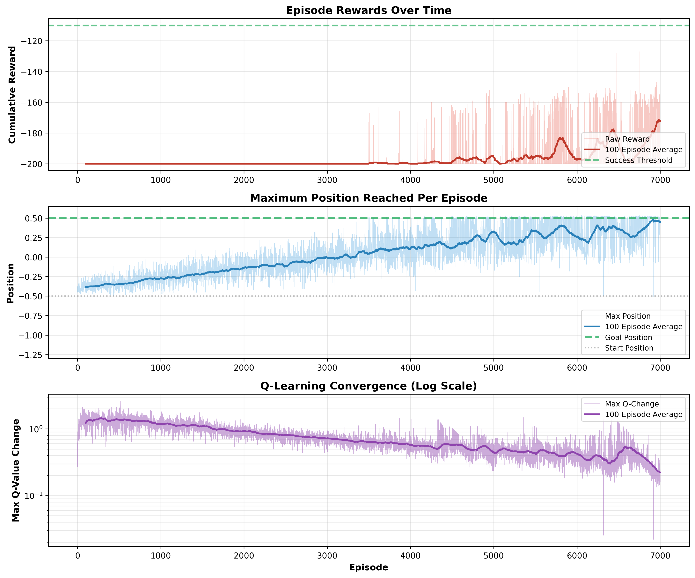
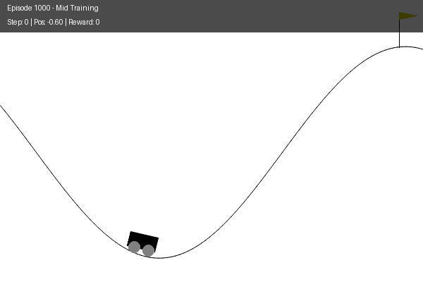
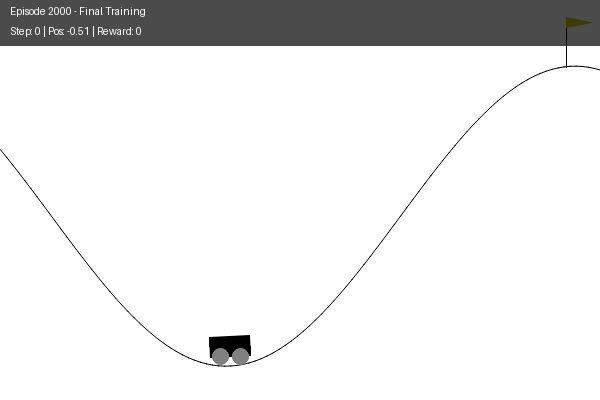

# MountainCar Reinforcement Learning
[](https://www.python.org/)
[](https://gymnasium.farama.org/)
[](LICENSE)
[](https://github.com/spouladchang/Mountain-Car-RL-Optimization/graphs/commit-activity)

Solving the classic MountainCar problem using Q-Learning and Deep Q-Network (DQN).


## Description

Welcome to this repository! Here, you will find implementations of two reinforcement learning algorithms: **Tabular Q-Learning** and **Deep Q-Network (DQN)**. Both are applied to the MountainCar-v0 environment provided by the Gymnasium library.

The task is deceptively simple: drive an underpowered car to reach a flag at the top of a hill. However, the car's engine lacks the power to ascend the slope in one continuous motion. Success hinges on learning to navigate back and forth to accumulate momentum for the climb. This scenario mirrors real-life situations where short-term sacrifices (going backward) lead to long-term success (reaching the goal), emphasizing the importance of far-sighted strategic decision-making.

This repository serves as a resource for enthusiasts and practitioners seeking to understand, compare, and implement reinforcement learning algorithms.

---

## Problem Definition

**Environment**: MountainCar-v0 from Gymnasium

**State Space**:
- Position: continuous range [-1.2, 0.6]
- Velocity: continuous range [-0.07, 0.07]

**Action Space**: 3 discrete actions
- 0: Accelerate Left
- 1: Don't Accelerate
- 2: Accelerate Right

**Reward Structure**:
- **-1** for every time step
- **0** when reaching the goal (position ≥ 0.5)

**Challenge**: The sparse reward (-1 per step) provides minimal guidance. The agent must discover through exploration that building momentum (moving backward first) leads to success.

---

## Algorithms Implemented

We solve this problem using two different approaches, each with unique characteristics:

### 1. Tabular Q-Learning with Discretization

**File**: [1_MountainCar_Q_Learning_Discretization.ipynb](./1_MountainCar_Q_Learning_Discretization.ipynb)

**What it does**:
- Converts the continuous state space into a discrete 25×25 grid
- Stores Q-values in a lookup table
- Updates values using the Bellman equation
- Selects actions using epsilon-greedy exploration

**Advantages**:
- ✅ **Simple**: Easy to understand and implement
- ✅ **Interpretable**: Can visualize the Q-table
- ✅ **Guaranteed convergence**: With proper exploration
- ✅ **No dependencies**: Only requires NumPy

**Disadvantages**:
- ❌ **Manual discretization required**: Must choose grid size
- ❌ **Doesn't scale**: Can't handle high-dimensional spaces
- ❌ **Slow convergence**: Needs 7000 episodes
- ❌ **Lower performance**: 75-88% success rate

**Hyperparameter Tuning**:

We systematically tested different discretization granularities:

| Grid Size | States | Success Rate | Training Time | Result |
|-----------|--------|--------------|---------------|--------|
| 15×15 | 225 | 65-75% | ~40s | Too coarse |
| 20×20 | 400 | 70-80% | ~50s | Baseline |
| **25×25** | **625** | **75-88%** | **~70s** | **✅ Best** |
| 30×30 | 900 | 72-85% | ~90s | Diminishing returns |

**Optimal Configuration**:
```
Buckets: 25×25
Learning Rate: 0.2 → 0.01 (decay: 0.9998)
Epsilon: 1.0 → 0.01 (decay: 0.9998)
Episodes: 7000
```

**Why 25×25?** It provides enough precision to distinguish important states without creating too many states that slow down learning.

---

### 2. Deep Q-Network (DQN)

**File**: [2_MountainCar_DQN_PyTorch.ipynb](./2_MountainCar_DQN_PyTorch.ipynb)

**What it does**:
- Uses a neural network to approximate the Q-function
- No discretization needed - handles continuous states directly
- Stores experiences in a replay buffer for efficient learning
- Uses a target network to stabilize training

**The DQN Algorithm**:

DQN is a **value-based**, **model-free**, and **off-policy** approach developed by DeepMind. It combines deep neural networks with traditional Q-learning to learn optimal policies from high-dimensional inputs.

**Advantages**:
- ✅ **Experience Replay**: Learns from past experiences multiple times, improving sample efficiency
- ✅ **No discretization**: Handles continuous states naturally
- ✅ **Fast convergence**: Only needs 2000 episodes
- ✅ **High performance**: 90-98% success rate
- ✅ **Scalable**: Can handle complex, high-dimensional problems

**Disadvantages**:
- ❌ **Hyperparameter sensitivity**: Performance depends heavily on tuning
- ❌ **Training instability**: Can experience performance collapse
- ❌ **Complexity**: Requires understanding of neural networks
- ❌ **Computational cost**: Slower per episode (~0.9s vs 0.01s)

**Hyperparameter Tuning**:

DQN's performance heavily depends on proper hyperparameter tuning. Key optimizations:

**Network Architecture**:
- Input: 2 features (position, velocity)
- Hidden layers: 256 → 256 neurons (ReLU activation)
- Output: 3 Q-values (one per action)

**Critical Settings**:
```
Learning Rate: 0.001
Epsilon Decay: 0.995 (slow decay crucial for sparse rewards)
Replay Buffer: 50,000 transitions
Batch Size: 64
Target Network Update: Every 10 episodes
Episodes: 2000
```

**Why these values?**
- **Slow epsilon decay** (0.995): Ensures sustained exploration. At episode 500, epsilon is still ~0.08 vs 0.01 with standard decay
- **Large replay buffer** (50,000): Provides diverse training samples
- **Frequent target updates** (every 10 episodes): Faster incorporation of learned knowledge

---

## Solution to Sparse Rewards

The primary challenge in MountainCar is the **sparse reward structure**. Receiving -1 for every step provides almost no guidance to the agent. The agent must rely on random exploration to accidentally discover the goal.

**Our Solutions**:

**For Q-Learning**:
- Slow decay rates to maintain exploration longer
- Higher minimum learning rate (0.01 vs 0.001) keeps adapting
- More episodes (7000) to ensure discovery

**For DQN**:
- Experience replay lets agent learn from rare successful episodes multiple times
- Larger replay buffer stores more diverse experiences
- Slow epsilon decay ensures sustained exploration
- Neural network can generalize from limited successful experiences

**Result**: Both methods successfully learn **without modifying the reward function**, proving that proper hyperparameter tuning is key.

---

## Results

### Performance Comparison

| Metric | Q-Learning | DQN | Winner |
|--------|-----------|-----|--------|
| **Success Rate** | 75-88% | 90-98% | 🥇 DQN |
| **Training Episodes** | 7000 | 2000 | 🥇 DQN |
| **Training Time** | ~70 seconds | ~30 minutes* | 🥇 Q-Learning |
| **Steps to Goal** | 160-180 | 100-110 | 🥇 DQN |
| **Simplicity** | ⭐⭐⭐⭐⭐ | ⭐⭐⭐ | 🥇 Q-Learning |
| **Scalability** | ⭐⭐ | ⭐⭐⭐⭐⭐ | 🥇 DQN |

*DQN takes longer per episode due to neural network computations, but needs fewer episodes

### Q-Learning Results

**Final Performance**:
- Success Rate: **75-88%**
- Average Reward: **-165 to -175**
- Training: 7000 episodes in ~70 seconds

**Learning Curve**:


*Shows three key metrics: episode rewards improving over time, maximum position gradually reaching the goal, and Q-value changes decreasing as the policy stabilizes.*

### DQN Results

**Final Performance**:
- Success Rate: **90-98%**
- Average Reward: **-100 to -110**
- Training: 2000 episodes in ~30 minutes
- Best average reward: **-98.93**

**Learning Curve**:


*Shows four metrics: rewards, maximum position, neural network loss converging, and epsilon decay ensuring sustained exploration.*

---

## Showcase

Watch the DQN agent learn to solve MountainCar across different training stages:

### Early Training (Episode 500)


*Agent explores randomly, struggles to build momentum, max position around -0.60*

### Mid Training (Episode 1000)


*Agent learns oscillation strategy, occasionally reaches the goal, max position ~0.50*

### Final Training (Episode 2000)


*Agent consistently solves the problem in ~100 steps with optimal policy*

---

## Requirements

```
numpy>=1.24.0
gymnasium>=0.29.0
matplotlib>=3.7.0
torch>=2.0.0
jupyter>=1.0.0
ipython>=8.12.0
```

**Installation**:
```bash
pip install -r requirements.txt
```

**Note**: This repository uses the latest **Gymnasium** library (not the deprecated Gym).

---

## Usage

### Quick Start

1. **Clone the repository**:
```bash
git clone [https://github.com/spouladchang/Mountain-Car-RL-Optimization.git](https://github.com/spouladchang/Mountain-Car-RL-Optimization.git)
cd Mountain-Car-RL-Optimization
```

2. **Install dependencies**:
```bash
pip install -r requirements.txt
```

3. **Launch Jupyter**:
```bash
jupyter notebook
```

4. **Run a notebook**:
   - `1_MountainCar_Q_Learning_Discretization.ipynb` for Q-Learning
   - `2_MountainCar_DQN_PyTorch.ipynb` for DQN

### Using Pre-trained Weights

Both implementations include pre-trained weights for immediate testing:

- **Q-Learning**: `trained_weights_discretization.npz` (auto-loads)
- **DQN**: `trained_weights_dqn.pth` (auto-loads)

Just run the notebooks - the code automatically detects these files and loads the optimal weights without retraining!

### Training from Scratch

If you wish to retrain the agents from scratch:
- Delete the weight files (.npz or .pth) from the directory.
- Run the notebook again. The code will detect the missing files and automatically start training

**Training times**:
- Q-Learning: ~70 seconds
- DQN: ~30 minutes

---

## Repository Structure

```
mountaincar-rl/
├── 1_MountainCar_Q_Learning_Discretization.ipynb
├── 2_MountainCar_DQN_PyTorch.ipynb
├── trained_weights_discretization.npz
├── trained_weights_dqn.pth
├── README.md
├── requirements.txt
├── LICENSE
└── assets/
    ├── qlearning_training.png
    ├── dqn_training.png
    ├── dqn_episode_500.gif
    ├── dqn_episode_1000.gif
    └── dqn_episode_2000.gif
```

---

## Key Takeaways

### When to Use Q-Learning
- ✅ Learning reinforcement learning fundamentals
- ✅ Simple, interpretable solutions needed
- ✅ Low-dimensional problems
- ✅ Limited computational resources

### When to Use DQN
- ✅ Need high performance and efficiency
- ✅ Complex, high-dimensional problems
- ✅ Willing to invest in hyperparameter tuning
- ✅ Building scalable RL systems

### Main Insights
1. **Sparse rewards are solvable**: Both methods succeed without reward shaping
2. **Hyperparameter tuning is critical**: Proper tuning makes or breaks performance
3. **DQN is sample efficient**: Needs 3.5× fewer episodes than Q-Learning
4. **Exploration is key**: Slow epsilon decay crucial for discovering rare successful trajectories

---

## References

1. Watkins, C.J.C.H. and Dayan, P. (1992). "Q-learning". *Machine Learning* 8(3): 279-292.
2. Mnih, V. et al. (2015). "Human-level control through deep reinforcement learning". *Nature* 518: 529-533.
3. Sutton, R. S. and Barto, A. G. (2018). "Reinforcement Learning: An Introduction". MIT Press.
4. Gymnasium Documentation: https://gymnasium.farama.org/

---

## License

This project is licensed under the MIT License - see the [LICENSE](LICENSE) file for details.

---

## Author

**Saeid Pouladchang**
- GitHub: [@spouladchang](https://github.com/spouladchang)
- Email: saeedpooladchang78@gmail.com

---

⭐ **If you find this repository helpful, please consider giving it a star!**

## Citation

```bibtex
@misc{mountaincar-rl-2026,
  author = {Saeid Pouladchang},
  title = {MountainCar Reinforcement Learning: Q-Learning vs DQN},
  year = {2026},
  publisher = {GitHub},
  url = {https://github.com/spouladchang/Mountain-Car-RL-Optimization}
}
```

